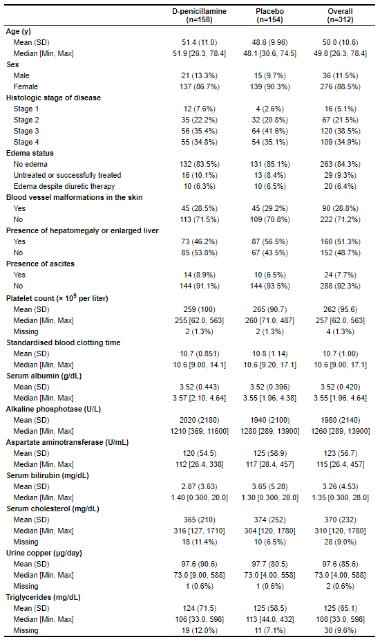

# table1

## Description

An R package for generating tables of descriptive statistics in HTML.

Table 1 is commonly used in biomedical research to describe characteristics of participants in the study and is often the first table in a published article. Table 1 displays descriptive statistics (e.g., mean, standard deviation) of characteristics overall and by the outcome or exposure variable of interest and sometimes includes p-value to test whether the characteristic significantly differ by the outcome or exposure variable of interest.

Read more about [Table 1](https://www.ncbi.nlm.nih.gov/pmc/articles/PMC6773463/)

## Installation

To install from CRAN:

``` r
install.packages("table1")
```

To install the latest development version directly from GitHub:

``` r
require(devtools)
devtools::install_github("benjaminrich/table1")
```

## Information
+ **Author, maintainer, copyright holder:** Benjamin Rich, [Original Github](https://github.com/benjaminrich/table1)
+ **Contributor:** Kening Jiang, [Website created](https://jhu-statprogramming-fall-2023.github.io/biostat777-project3-part1-KeningJiang/)

## Customization of the website
+ **Customize readme header:** the package name in the navbar is removed with strip_header: true.

+ **Customize author information in the sidebar, the left part side of the footer, the author page:** Add Kening jiang as a contributor in the DESCRIPTION file and change the display of both authors and modify text before the author names.

+ **Theming:** Change the (1) bootswatch, (2) theme, and (3) bslib settings to override the default theme.

+ **Customize the Navbar:** Change the style and layout of the navigation bar by changing the (1) structure and (2) component where the articles menu is updated to include original vignettes from the developer and the example analysis that's newly added.

+ **Customize the sidebar:** Update the sidebar to include citation, authors, links and license with the DESCRIPTION file updated correspondingly.

## Functions
A list of exported functions is also available under the **reference** tab.

**as.data.frame(<table1>)**
- Convert a table1 object to a data.frame.

**eqcut() eqcut.default.labeling()**
- Cut a continuous variable into equal-sized groups.

**knit_print(<table1>)**
- Method for printing in a knitr context.

**label() `label<-`() setLabel() has.label()**
- Label attribute.

**parse.abbrev.render.code()**
- Parse abbreviated code for rendering table output.

**print(<table1>)**
- Print table1 object.

**render.categorical.default()**
- Render categorical values for table output.

**render.continuous.default()**
- Render continuous values for table output.

**render.default()**
- Render values for table output.

**render.missing.default()**
- Render missing values for table output.

**render.varlabel()**
- Render variable labels for table output.

**signif_pad() round_pad()**
- Round numbers with 0-padding.

**stats.apply.rounding()**
- Apply rounding to basic descriptive statistics.

**stats.default()**
- Compute some basic descriptive statistics.

**subsetp()**
- Subset function that preserves column attributes.

**t1flex()**
- Convert a table1 object to flextable.

**t1kable()**
- Convert a table1 object to kabelExtra.

**t1read()**
- Read and augment data with extended metadata attributes

**table.rows() table.data()**
- Convert to HTML table rows.

**table1()**
- Generate an HTML table of descriptive statistics.

**units() `units<-`() has.units()**
- Units attribute.

**update_html()**
- Update HTML.

## Example

For this example, we will use data from the Mayo Clinic trial in primary biliary cirrhosis (PBC) of the liver found in the `survival` package.

``` r
require(table1)
require(survival)

dat <- subset(survival::pbc, !is.na(trt))  # Exclude subjects not randomized

dat$trt     <- factor(dat$trt, levels=1:2, labels=c("D-penicillamine", "Placebo"))
dat$sex     <- factor(dat$sex, levels=c("m", "f"), labels=c("Male", "Female"))
dat$stage   <- factor(dat$stage, levels=1:4, labels=paste("Stage", 1:4))
dat$edema   <- factor(dat$edema, levels=c(0, 0.5, 1),
                      labels=c("No edema",
                               "Untreated or successfully treated",
                               "Edema despite diuretic therapy"))
dat$spiders <- as.logical(dat$spiders)
dat$hepato  <- as.logical(dat$hepato)
dat$ascites <- as.logical(dat$ascites)

label(dat$age)      <- "Age (y)"
label(dat$sex)      <- "Sex"
label(dat$stage)    <- "Histologic stage of disease"
label(dat$edema)    <- "Edema status"
label(dat$spiders)  <- "Blood vessel malformations in the skin"
label(dat$hepato)   <- "Presence of hepatomegaly or enlarged liver"
label(dat$ascites)  <- "Presence of ascites"
label(dat$platelet) <- "Platelet count (&times; 10<sup>9</sup> per liter)"
label(dat$protime)  <- "Standardised blood clotting time"
label(dat$albumin)  <- "Serum albumin (g/dL)"
label(dat$alk.phos) <- "Alkaline phosphotase (U/L)"
label(dat$ast)      <- "Aspartate aminotransferase (U/mL)"
label(dat$bili)     <- "Serum bilirubin (mg/dL)"
label(dat$chol)     <- "Serum cholesterol (mg/dL)"
label(dat$copper)   <- "Urine copper (&mu;g/day)"
label(dat$trig)     <- "Triglycerides (mg/dL)"

table1(~ age + sex + stage + edema + spiders + hepato + ascites +
         platelet + protime + albumin + alk.phos + ast + bili + chol +
         copper + trig | trt, data=dat)
```



[](https://CRAN.R-project.org/package=table1)
[](https://CRAN.R-project.org/package=table1)
